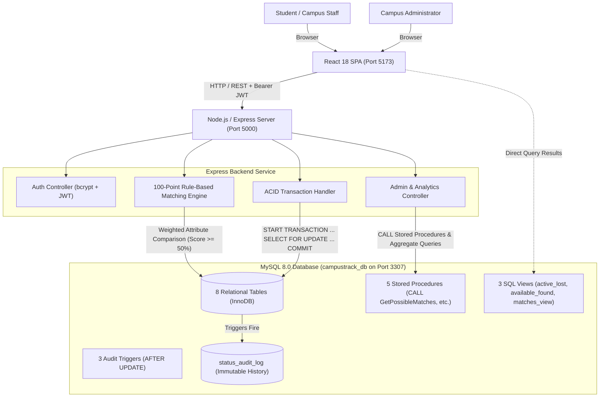
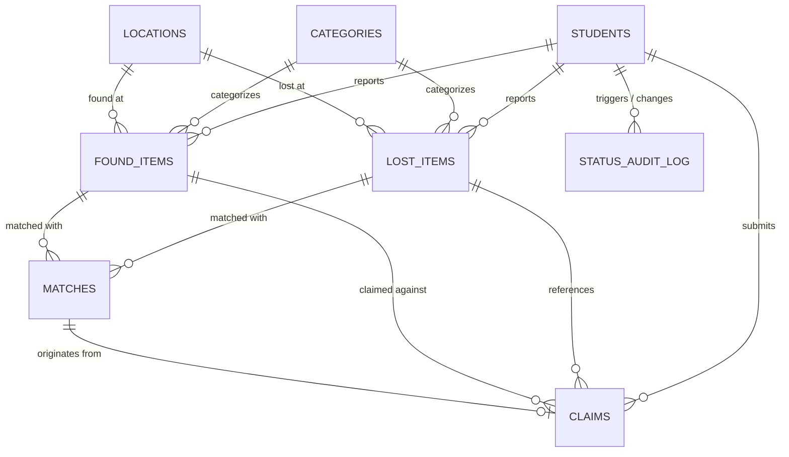

# CAMPUSTRACK — Campus Lost & Found Management System
> **College DBMS Capstone Project & Faculty Evaluation Guide**  
> *A production-ready, full-stack, database-driven application built with React, Node.js/Express, and genuine MySQL 8.0.*

---

## 🌟 Executive Summary

**CampusTrack** is a centralized web platform designed for university campuses to streamline the reporting, tracking, matching, and returning of lost and found personal belongings. Unlike naive mockups or static demo apps, CampusTrack is backed by a fully normalized MySQL 8.0 relational database implementing strict relational integrity, stored procedures, audit triggers, database views, row-level locking, and ACID transactions.

---

## 🚀 Quick Start & Live Access

CampusTrack runs across three coordinated services:

| Component | URL / Endpoint | Port | Description |
|---|---|---|---|
| **Frontend Web App** | `http://localhost:5173` | `5173` | React 18 + Vite + Tailwind CSS + Lucide Icons |
| **Backend REST API** | `http://localhost:5000/api` | `5000` | Node.js + Express REST API |
| **MySQL 8.0 Database** | `127.0.0.1:3307` (`campustrack_db`) | `3307` | Genuine MySQL 8.0 Community Server |

### Pre-Configured Demo Credentials

For rapid viva demonstrations, the login screens include **1-Click Demo Login** buttons:

| Role | Email | Password | Access Level |
|---|---|---|---|
| **Student** | `student@campustrack.edu` | `Student@123` | Report lost/found, search catalog, review match suggestions, submit claims |
| **Administrator** | `admin@campustrack.edu` | `Admin@123` | Executive KPI analytics, claims approval (ACID), item status override, student directory, audit logs |

---

## 🛠️ Technology Stack

- **Frontend**:
  - React 18 (Vite build tool)
  - Tailwind CSS (Custom dark theme with glassmorphic cards and amber accents)
  - Lucide React (Crisp modern iconography)
  - Axios (Configured with request/response interceptors and JWT handling)
- **Backend**:
  - Node.js & Express.js
  - `mysql2/promise` (Connection pool with prepared statements preventing SQL injection)
  - `bcryptjs` (Salted hashing for student and admin passwords)
  - `jsonwebtoken` (Stateless token-based authentication)
  - `dotenv` & `cors`
- **Database**:
  - MySQL Server 8.0 (InnoDB engine, utf8mb4 encoding)
  - 8 Normalized tables (3NF)
  - 3 Materialized SQL views
  - 5 Custom stored procedures
  - 3 Automated status audit triggers
  - Explicit multi-statement ACID transactions

---

## 📐 Architecture & Data Flow



---

## 🗄️ Relational Database Design (DBMS Viva Ready)

The database schema is fully normalized into **Third Normal Form (3NF)** to eliminate data redundancy and anomalies.

### Schema Entity-Relationship (ER) Model



### Table Breakdown

1. **`students`**: Stores registered student and administrator accounts.
   - `student_id` (PK, AUTO_INCREMENT)
   - `reg_no` (VARCHAR 30, UNIQUE)
   - `full_name` (VARCHAR 100)
   - `email` (VARCHAR 120, UNIQUE)
   - `password_hash` (VARCHAR 255)
   - `phone` (VARCHAR 20)
   - `department` (VARCHAR 80)
   - `role` (ENUM: `'student'`, `'admin'`)
   - `created_at` (DATETIME DEFAULT CURRENT_TIMESTAMP)

2. **`categories`**: Normalized lookup of item categories (Electronics, Bags, Wallets, IDs, Keys, Books, etc.).
   - `category_id` (PK), `category_name`, `description`, `icon`

3. **`locations`**: Normalized campus locations (Central Library, Engineering Block, Sports Complex, Student Union, etc.).
   - `location_id` (PK), `location_name`, `building`, `floor_zone`

4. **`lost_items`**: Reports filed by students for missing belongings.
   - `lost_id` (PK), `student_id` (FK ➔ `students`), `category_id` (FK ➔ `categories`), `location_id` (FK ➔ `locations`)
   - `item_name`, `description`, `brand`, `primary_color`, `date_lost`, `approx_time`, `identifying_details`
   - `status` (ENUM: `'Lost'`, `'Matched'`, `'Claimed'`, `'Closed'`)

5. **`found_items`**: Reports registered by finders or campus staff.
   - `found_id` (PK), `student_id` (FK ➔ `students`), `category_id` (FK ➔ `categories`), `location_id` (FK ➔ `locations`)
   - `item_name`, `description`, `brand`, `primary_color`, `date_found`, `approx_time`, `identifying_details`, `storage_location`
   - `status` (ENUM: `'Found'`, `'Matched'`, `'Claimed'`, `'Closed'`)

6. **`matches`**: Links candidate lost and found items with a computed match score.
   - `match_id` (PK), `lost_id` (FK ➔ `lost_items`), `found_id` (FK ➔ `found_items`)
   - `score` (INT 0-100), `match_status` (ENUM: `'Suggested'`, `'Verified'`, `'Dismissed'`)
   - `score_breakdown` (JSON), `created_at`, `verified_at`
   - UNIQUE KEY (`lost_id`, `found_id`)

7. **`claims`**: Ownership claims submitted by students with proof and verification answers.
   - `claim_id` (PK), `match_id` (FK ➔ `matches`), `lost_id` (FK ➔ `lost_items`), `found_id` (FK ➔ `found_items`), `claimant_id` (FK ➔ `students`)
   - `claim_description`, `identifying_marks`, `proof_details`
   - `claim_status` (ENUM: `'Pending'`, `'Under Review'`, `'Approved'`, `'Rejected'`, `'Closed'`)
   - `admin_remarks`, `reviewed_by` (FK ➔ `students`), `reviewed_at`, `resolved_at`

8. **`status_audit_log`**: Immutable audit log populated automatically via database triggers.
   - `log_id` (PK), `entity_type` (ENUM: `'LOST'`, `'FOUND'`, `'CLAIM'`), `entity_id` (INT)
   - `old_status` (VARCHAR 30), `new_status` (VARCHAR 30)
   - `changed_by` (FK ➔ `students`), `change_notes` (TEXT), `timestamp` (DATETIME)

---

## 🎯 100-Point Rule-Based Matching Engine

When a lost or found item is created, the system executes a deterministic 100-point matching evaluation comparing active reports:

$$\text{Total Score} = S_{\text{Category}} + S_{\text{Location}} + S_{\text{Color}} + S_{\text{Brand}} + S_{\text{Description}} + S_{\text{Date}}$$

| Factor | Weight | Evaluation Logic |
|---|---|---|
| **Category Match** | **25 pts** | Exact matching of `category_id` |
| **Location Match** | **25 pts** | Exact matching of `location_id` |
| **Color Match** | **15 pts** | Normalized substring / exact case-insensitive color match |
| **Brand Match** | **15 pts** | Case-insensitive brand equality |
| **Description Match** | **10 pts** | Keyword overlap in `item_name` and `description` |
| **Date Proximity** | **10 pts** | Within 3 days: 10 pts; within 7 days: 6 pts; within 14 days: 3 pts |

- **Threshold**: Pairs scoring **$\ge 50\%$** are persisted to the `matches` table and flagged as `Suggested`.
- If score is **$\ge 80\%$**, the items are automatically moved to status `Matched`.

---

## 🛡️ ACID Transactions Implementation

CampusTrack implements genuine database transactions to guarantee data consistency during claim handovers.

### The Problem it Solves:
Without ACID transactions, if a claim approval crashes midway through updating the found item, the lost item could remain marked as `Lost` while the found item is marked as `Claimed`, causing orphaned records and double claims.

### Transaction Logic (`services/transactionService.js`):
```sql
START TRANSACTION;

-- 1. Row-level pessimistic locking
SELECT claim_id, found_id, lost_id, claim_status 
FROM claims 
WHERE claim_id = ? 
FOR UPDATE;

SELECT found_id, status 
FROM found_items 
WHERE found_id = ? 
FOR UPDATE;

-- 2. Validate current state
-- Ensure found item is not already 'Claimed' or 'Closed'

-- 3. Atomic Updates
UPDATE claims 
SET claim_status = 'Approved', reviewed_by = ?, admin_remarks = ?, reviewed_at = NOW() 
WHERE claim_id = ?;

UPDATE found_items 
SET status = 'Claimed' 
WHERE found_id = ?;

UPDATE lost_items 
SET status = 'Claimed' 
WHERE lost_id = ?;

-- 4. Record Audit Trail
INSERT INTO status_audit_log (entity_type, entity_id, old_status, new_status, changed_by, change_notes)
VALUES ('CLAIM', ?, 'Pending', 'Approved', ?, 'Claim approved by admin');

COMMIT; -- Or ROLLBACK on any failure
```

---

## 📊 Stored Procedures, Views & Triggers

All DBMS assets reside in `database/` and are actively executed by the backend:

### 1. Stored Procedures (`database/procedures.sql`)
- `CALL GetStudentReports(IN studentId INT)`: Consolidates lost items, found items, and claims filed by a specific student using subqueries.
- `CALL GetPossibleMatches(IN lostId INT, IN minScore INT)`: Queries suggested matches above a specific threshold with joined category and location data.
- `CALL GetCategoryStatistics()`: Aggregates total lost, total found, returned count, and recovery percentage grouped by category.
- `CALL GetLocationStatistics()`: Computes frequency of lost/found incidents per campus building.
- `CALL ApproveClaimAndReturnItem(IN claimId INT, IN adminId INT, IN remarks TEXT)`: In-database procedure encapsulating the transaction logic.

### 2. Database Views (`database/views.sql`)
- `active_lost_items`: Unresolved lost items (`Lost` or `Matched`) joined with student, category, and location metadata.
- `available_found_items`: Unclaimed found items currently held at storage desks.
- `comprehensive_matches_view`: High-dimensional join combining match scores, item names, descriptions, and both claimant and finder contact info.

### 3. Database Triggers (`database/triggers.sql`)
- `trg_audit_lost_status`: `AFTER UPDATE` trigger on `lost_items` that writes to `status_audit_log` whenever `status` changes.
- `trg_audit_found_status`: `AFTER UPDATE` trigger on `found_items` logging status transitions.
- `trg_audit_claim_status`: `AFTER UPDATE` trigger on `claims` recording every review approval or rejection.

---

## 🧪 Verification & End-to-End Testing

You can run the automated end-to-end verification script anytime from the project root:

```bash
node test_e2e.js
```

### What this test verifies:
1. **Student Login**: Authenticates via `bcrypt` and JWT issuance.
2. **Report Lost Item**: Inserts record into `lost_items` with location and category FKs.
3. **Report Found Item**: Inserts matching item into `found_items`.
4. **Matching Engine**: Deterministic calculation generates a **100% score match** and persists to `matches`.
5. **Submit Claim**: Student submits proof of ownership and identification details.
6. **Admin Login**: Admin signs in and accesses review queue.
7. **ACID Transaction**: Admin approves claim — executes `START TRANSACTION`, row lock `FOR UPDATE`, updates `claims`, `lost_items`, and `found_items` synchronously, and executes `COMMIT`.
8. **Case Closure**: Formally archives case and resolves status.
9. **Audit Trail**: Verifies trigger-generated log rows in `status_audit_log`.
10. **Stored Procedures**: Executes `CALL GetCategoryStatistics()` and `CALL GetLocationStatistics()`.
11. **Dashboard KPIs**: Aggregates totals and calculates campus resolution rate.

---

## 🎓 Faculty Viva Q&A Cheat Sheet

Prepare these exact answers when demonstrating CampusTrack to evaluators:

### Q1: How is your database normalized?
> **Answer**: The database is structured in **3rd Normal Form (3NF)**:
> - **1NF**: Every column holds atomic (scalar) values; no repeating groups.
> - **2NF**: All non-key attributes are fully functionally dependent on the primary key (no partial dependencies).
> - **3NF**: There are no transitive dependencies; lookup values like `categories` and `locations` are decoupled into their own relation tables rather than duplicated across item rows.

### Q2: How does CampusTrack prevent race conditions when two students claim the same item?
> **Answer**: We use **pessimistic row-level locking** (`SELECT ... FOR UPDATE`) inside an explicit **ACID transaction**. When an admin opens a claim for approval, the specific `found_item` and `claim` rows are locked in InnoDB. If another transaction attempts to approve a competing claim on the same item, it must wait or abort because the found item status changes from `Found` to `Claimed`, causing competing transactions to rollback.

### Q3: What is the purpose of database triggers in this project?
> **Answer**: We defined `AFTER UPDATE` triggers on `lost_items`, `found_items`, and `claims`. Whenever a status column is altered (e.g., from `Lost` to `Claimed`), the trigger automatically writes an immutable log row into `status_audit_log` with the old value, new value, timestamp, and actor identity. This provides auditing for security and prevents fraud without relying solely on application-level code.

### Q4: How does the matching algorithm work?
> **Answer**: It is a transparent, rule-based 100-point algorithm implemented in the backend service. It assigns weights to: Category (25%), Location (25%), Color (15%), Brand (15%), Keyword overlap (10%), and Date proximity (10%). Matches above 50% are automatically suggested, and matches above 80% mark the items as candidate matches in the database.

---

## 📂 Project Directory Structure

```
campustrack/
├── backend/
│   ├── config/
│   │   └── db.js                 # MySQL 8.0 connection pool configuration
│   ├── controllers/
│   │   ├── adminController.js    # KPIs, analytics, audit trail, case closure
│   │   ├── authController.js     # Student & Admin authentication
│   │   ├── claimController.js    # Claim filing and history
│   │   ├── foundController.js    # Found item CRUD and auto-matching
│   │   ├── lostController.js     # Lost item CRUD and auto-matching
│   │   ├── matchController.js    # Matches retrieval and manual verify
│   │   └── metaController.js     # Categories and locations lookup
│   ├── middleware/
│   │   ├── auth.js               # JWT verification & role authorization
│   │   └── errorHandler.js       # Centralized error handler
│   ├── routes/                   # Express REST API route definitions
│   ├── services/
│   │   ├── matchingService.js    # 100-point deterministic matching engine
│   │   └── transactionService.js # ACID transactions (START TRANSACTION, FOR UPDATE, COMMIT)
│   ├── package.json
│   └── server.js                 # Backend entrypoint (Port 5000)
├── database/
│   ├── schema.sql                # DDL for 8 normalized tables
│   ├── views.sql                 # 3 SQL views
│   ├── procedures.sql            # 5 Stored procedures
│   ├── triggers.sql              # 3 Audit triggers
│   ├── transactions.sql          # ACID transaction demonstration scripts
│   ├── seed.sql                  # Comprehensive demo seed data
│   └── complete_init.sql         # Consolidated initialization file
├── frontend/
│   ├── src/
│   │   ├── components/           # Navbar, Sidebar, Badges, Modals, StatCards
│   │   ├── contexts/             # AuthContext (roles), ToastContext (notifications)
│   │   ├── pages/                # Student & Admin web pages
│   │   ├── services/             # Axios API client
│   │   ├── App.jsx               # Client-side router
│   │   └── main.jsx              # React DOM entry
│   ├── index.html
│   ├── package.json
│   └── tailwind.config.js
├── test_e2e.js                   # Automated end-to-end test runner
├── start.js                      # Multi-service launcher script
├── README.md                     # This documentation
└── package.json                  # Root runner package.json
```

---

## 🖥️ Manual Startup Commands

If restarting services individually:

1. **MySQL 8.0 Server (Port 3307)**:
   ```powershell
   & "C:\Program Files\MySQL\MySQL Server 8.0\bin\mysqld.exe" --no-defaults --datadir="C:\Users\mohul\.gemini\antigravity\scratch\campustrack\database\mysql_data" --port=3307 --console
   ```
2. **Backend API (Port 5000)**:
   ```bash
   cd backend
   node server.js
   ```
3. **Frontend (Port 5173)**:
   ```bash
   cd frontend
   npm run dev
   ```
Or simply run from project root:
```bash
npm run dev
```
